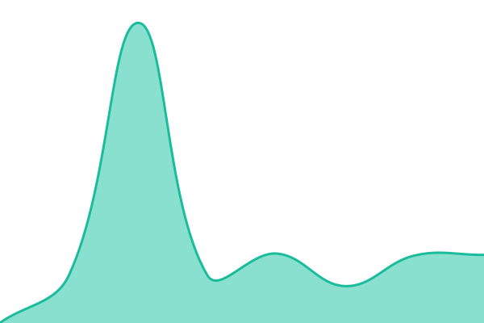

# [📈 Live Status](https://gudasoft.github.io/upptime): <!--live status--> **🟧 Partial outage**

This repository contains the uptime monitor and status page for [Gudasoft](https://www.gudasoft.com/).

<!--start: status pages-->
<!-- This summary is generated by Upptime (https://github.com/upptime/upptime) -->
<!-- Do not edit this manually, your changes will be overwritten -->
<!-- prettier-ignore -->
| URL | Status | History | Response Time | Uptime |
| --- | ------ | ------- | ------------- | ------ |
|  [Cenite.com](https://www.cenite.com) | 🟩 Up | [cenite-com.yml](https://github.com/gudasoft/upptime/commits/HEAD/history/cenite-com.yml) | 

 533ms
     
 | 

<a href="https://gudasoft.github.io/upptime/history/cenite-com">66.70%</a>
    

|  [Gudasoft.com](https://www.gudasoft.com/) | 🟩 Up | [gudasoft-com.yml](https://github.com/gudasoft/upptime/commits/HEAD/history/gudasoft-com.yml) | 

 128ms
     
 | 

<a href="https://gudasoft.github.io/upptime/history/gudasoft-com">100.00%</a>
    

|  [Gudasoft Blog](https://blog.gudasoft.com/) | 🟩 Up | [gudasoft-blog.yml](https://github.com/gudasoft/upptime/commits/HEAD/history/gudasoft-blog.yml) | 

 1137ms
     
 | 

<a href="https://gudasoft.github.io/upptime/history/gudasoft-blog">66.71%</a>
    

|  [Data Listener](https://data-listener.gudasoft.com/) | 🟩 Up | [data-listener.yml](https://github.com/gudasoft/upptime/commits/HEAD/history/data-listener.yml) | 

 507ms
     
 | 

<a href="https://gudasoft.github.io/upptime/history/data-listener">66.71%</a>
    

|  [Podcast Gudasoft](https://podcast.gudasoft.com/) | 🟩 Up | [podcast-gudasoft.yml](https://github.com/gudasoft/upptime/commits/HEAD/history/podcast-gudasoft.yml) | 

 773ms
     
 | 

<a href="https://gudasoft.github.io/upptime/history/podcast-gudasoft">66.71%</a>
    

|  [Wannapik](https://www.wannapik.com/) | 🟥 Down | [wannapik.yml](https://github.com/gudasoft/upptime/commits/HEAD/history/wannapik.yml) | 

 89ms
     
 | 

<a href="https://gudasoft.github.io/upptime/history/wannapik">100.00%</a>
    

|  [Kvartala](https://www.kvartala.bg/) | 🟩 Up | [kvartala.yml](https://github.com/gudasoft/upptime/commits/HEAD/history/kvartala.yml) | 

 7924ms
     
 | 

<a href="https://gudasoft.github.io/upptime/history/kvartala">66.71%</a>
    

|  [Advokatalexiev](https://advokatalexiev.com/) | 🟩 Up | [advokatalexiev.yml](https://github.com/gudasoft/upptime/commits/HEAD/history/advokatalexiev.yml) | 

 977ms
     
 | 

<a href="https://gudasoft.github.io/upptime/history/advokatalexiev">67.73%</a>
    

|  [Tkhold](http://tkhold.com) | 🟩 Up | [tkhold.yml](https://github.com/gudasoft/upptime/commits/HEAD/history/tkhold.yml) | 

 1385ms
     
 | 

<a href="https://gudasoft.github.io/upptime/history/tkhold">66.72%</a>
    

|  [Advokatalexiev](https://advokatalexiev.com/) | 🟩 Up | [advokatalexiev.yml](https://github.com/gudasoft/upptime/commits/HEAD/history/advokatalexiev.yml) | 

 977ms
     
 | 

<a href="https://gudasoft.github.io/upptime/history/advokatalexiev">67.73%</a>
    

|  [Belassitsa](http://belassitsa.com/) | 🟩 Up | [belassitsa.yml](https://github.com/gudasoft/upptime/commits/HEAD/history/belassitsa.yml) | 

 1849ms
     
 | 

<a href="https://gudasoft.github.io/upptime/history/belassitsa">67.74%</a>
    

|  [Pancharevo-bg.com](https://www.pancharevo-bg.com/) | 🟩 Up | [pancharevo-bg-com.yml](https://github.com/gudasoft/upptime/commits/HEAD/history/pancharevo-bg-com.yml) | 

 499ms
     
 | 

<a href="https://gudasoft.github.io/upptime/history/pancharevo-bg-com">85.72%</a>
    

|  [Qredy](https://new.qredy.com/) | 🟩 Up | [qredy.yml](https://github.com/gudasoft/upptime/commits/HEAD/history/qredy.yml) | 

 182ms
     
 | 

<a href="https://gudasoft.github.io/upptime/history/qredy">100.00%</a>
    

<!--end: status pages-->

[**Visit our status website →**](https://gudasoft.github.io/upptime)

## 📄 Credits

- Powered by: [Upptime](https://github.com/upptime/upptime)
- Code: [MIT](./LICENSE) © [Anand Chowdhary](https://anandchowdhary.com), supported by [Pabio](https://pabio.com)
- Data in the `./history` directory: [Open Database License](https://opendatacommons.org/licenses/odbl/1-0/)
