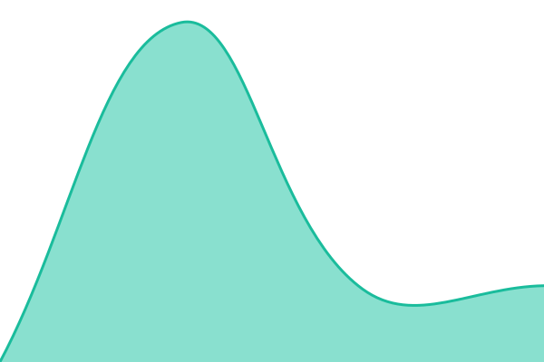

# [📈 Live Status](https://gudasoft.github.io/upptime): <!--live status--> **🟧 Partial outage**

<!--start: status pages-->
<!-- This summary is generated by Upptime (https://github.com/upptime/upptime) -->
<!-- Do not edit this manually, your changes will be overwritten -->
<!-- prettier-ignore -->
| URL | Status | History | Response Time | Uptime |
| --- | ------ | ------- | ------------- | ------ |
|  [Cenite.com](https://www.cenite.com) | 🟩 Up | [cenite-com.yml](https://github.com/gudasoft/upptime/commits/HEAD/history/cenite-com.yml) | 

 4894ms
     
 | 

<a href="https://gudasoft.github.io/upptime/history/cenite-com">81.14%</a>
    

|  [Gudasoft.com](https://www.gudasoft.com/) | 🟩 Up | [gudasoft-com.yml](https://github.com/gudasoft/upptime/commits/HEAD/history/gudasoft-com.yml) | 

 218ms
     
 | 

<a href="https://gudasoft.github.io/upptime/history/gudasoft-com">81.15%</a>
    

|  [Gudasoft Blog](https://blog.gudasoft.com/) | 🟥 Down | [gudasoft-blog.yml](https://github.com/gudasoft/upptime/commits/HEAD/history/gudasoft-blog.yml) | 

 521ms
     
 | 

<a href="https://gudasoft.github.io/upptime/history/gudasoft-blog">0.00%</a>
    

|  [Data Listener](https://data-listener.gudasoft.com/) | 🟩 Up | [data-listener.yml](https://github.com/gudasoft/upptime/commits/HEAD/history/data-listener.yml) | 

 680ms
     
 | 

<a href="https://gudasoft.github.io/upptime/history/data-listener">81.24%</a>
    

|  [Podcast Gudasoft](https://podcast.gudasoft.com/) | 🟩 Up | [podcast-gudasoft.yml](https://github.com/gudasoft/upptime/commits/HEAD/history/podcast-gudasoft.yml) | 

 850ms
     
 | 

<a href="https://gudasoft.github.io/upptime/history/podcast-gudasoft">81.29%</a>
    

|  [Wannapik](https://www.wannapik.com/) | 🟥 Down | [wannapik.yml](https://github.com/gudasoft/upptime/commits/HEAD/history/wannapik.yml) | 

 52ms
     
 | 

<a href="https://gudasoft.github.io/upptime/history/wannapik">100.00%</a>
    

|  [Kvartala](https://www.kvartala.bg/) | 🟩 Up | [kvartala.yml](https://github.com/gudasoft/upptime/commits/HEAD/history/kvartala.yml) | 

 7269ms
     
 | 

<a href="https://gudasoft.github.io/upptime/history/kvartala">81.31%</a>
    

|  [Advokatalexiev](https://advokatalexiev.com/) | 🟩 Up | [advokatalexiev.yml](https://github.com/gudasoft/upptime/commits/HEAD/history/advokatalexiev.yml) | 

 1005ms
     
 | 

<a href="https://gudasoft.github.io/upptime/history/advokatalexiev">81.33%</a>
    

|  [Tkhold](http://www.tkhold.com/) | 🟩 Up | [tkhold.yml](https://github.com/gudasoft/upptime/commits/HEAD/history/tkhold.yml) | 

 4130ms
     
 | 

<a href="https://gudasoft.github.io/upptime/history/tkhold">82.38%</a>
    

|  [Belassitsa](http://belassitsa.com/) | 🟩 Up | [belassitsa.yml](https://github.com/gudasoft/upptime/commits/HEAD/history/belassitsa.yml) | 

 2547ms
     
 | 

<a href="https://gudasoft.github.io/upptime/history/belassitsa">82.43%</a>
    

|  [Pancharevo-bg.com](https://www.pancharevo-bg.com/) | 🟩 Up | [pancharevo-bg-com.yml](https://github.com/gudasoft/upptime/commits/HEAD/history/pancharevo-bg-com.yml) | 

 4598ms
     
 | 

<a href="https://gudasoft.github.io/upptime/history/pancharevo-bg-com">82.44%</a>
    

|  [Host Manager](https://host-manager.gudasoft.com/) | 🟩 Up | [host-manager.yml](https://github.com/gudasoft/upptime/commits/HEAD/history/host-manager.yml) | 

 730ms
     
 | 

<a href="https://gudasoft.github.io/upptime/history/host-manager">82.49%</a>
    

|  [Coaching zone](https://krasimira.dukovska.kvartala.bg) | 🟩 Up | [coaching-zone.yml](https://github.com/gudasoft/upptime/commits/HEAD/history/coaching-zone.yml) | 

 1178ms
     
 | 

<a href="https://gudasoft.github.io/upptime/history/coaching-zone">82.50%</a>
    

|  [Coaching zone - Krasimira Dukovska](https://coaching-zone.kvartala.bg/) | 🟩 Up | [coaching-zone-krasimira-dukovska.yml](https://github.com/gudasoft/upptime/commits/HEAD/history/coaching-zone-krasimira-dukovska.yml) | 

 1080ms
     
 | 

<a href="https://gudasoft.github.io/upptime/history/coaching-zone-krasimira-dukovska">82.52%</a>
    

|  [Vertical Design](https://www.verticalsdesign.bg/) | 🟩 Up | [vertical-design.yml](https://github.com/gudasoft/upptime/commits/HEAD/history/vertical-design.yml) | 

 4014ms
     
 | 

<a href="https://gudasoft.github.io/upptime/history/vertical-design">82.56%</a>
    

|  [Arcadia](http://www.arcadiabg.eu/) | 🟩 Up | [arcadia.yml](https://github.com/gudasoft/upptime/commits/HEAD/history/arcadia.yml) | 

 900ms
     
 | 

<a href="https://gudasoft.github.io/upptime/history/arcadia">82.61%</a>
    

|  [Dentist](http://dentist.gudasoft.com/) | 🟩 Up | [dentist.yml](https://github.com/gudasoft/upptime/commits/HEAD/history/dentist.yml) | 

 734ms
     
 | 

<a href="https://gudasoft.github.io/upptime/history/dentist">82.66%</a>
    

|  [DGD](http://dgd.gudasoft.com/) | 🟩 Up | [dgd.yml](https://github.com/gudasoft/upptime/commits/HEAD/history/dgd.yml) | 

 462ms
     
 | 

<a href="https://gudasoft.github.io/upptime/history/dgd">82.71%</a>
    

|  [rezovo](http://rezovo.net/) | 🟩 Up | [rezovo.yml](https://github.com/gudasoft/upptime/commits/HEAD/history/rezovo.yml) | 

 861ms
     
 | 

<a href="https://gudasoft.github.io/upptime/history/rezovo">82.72%</a>
    

|  [negociant](https://negociant.bg/) | 🟩 Up | [negociant.yml](https://github.com/gudasoft/upptime/commits/HEAD/history/negociant.yml) | 

 2279ms
     
 | 

<a href="https://gudasoft.github.io/upptime/history/negociant">5.96%</a>
    

<!--end: status pages-->

[**Visit our status website →**](https://gudasoft.github.io/upptime)

## 📄 Credits

- Powered by: [Upptime](https://github.com/upptime/upptime)
- Code: [MIT](./LICENSE) © [Anand Chowdhary](https://anandchowdhary.com), supported by [Pabio](https://pabio.com)
- Data in the `./history` directory: [Open Database License](https://opendatacommons.org/licenses/odbl/1-0/)
