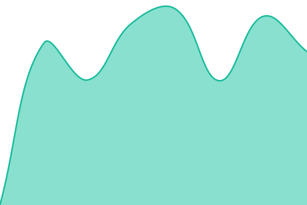
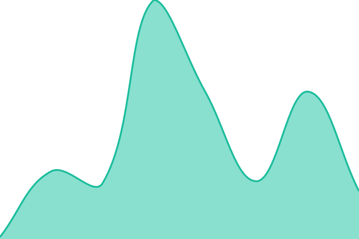
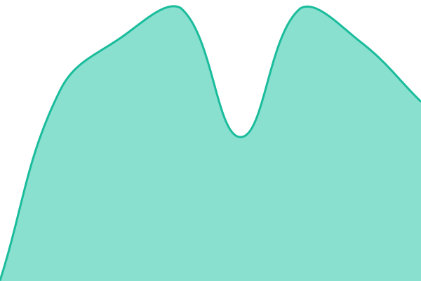
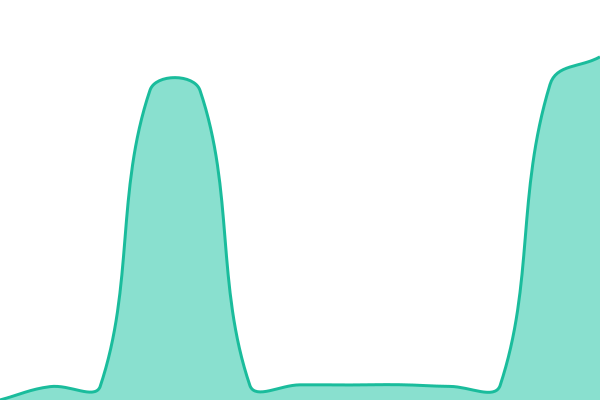
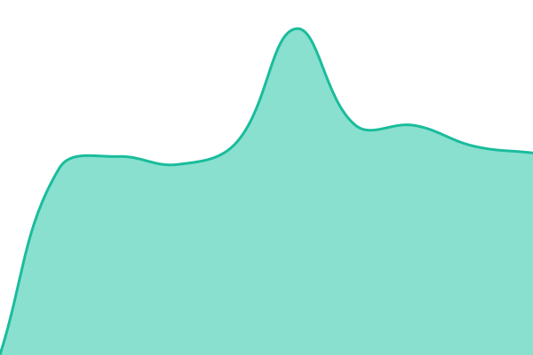
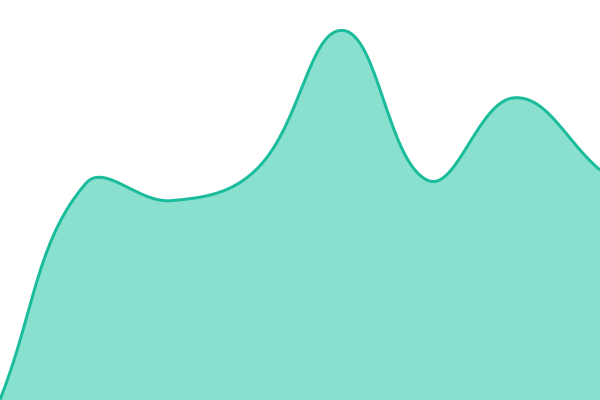
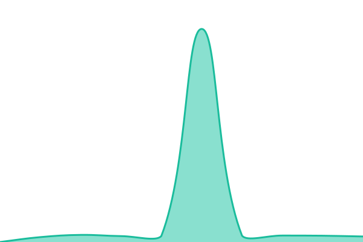
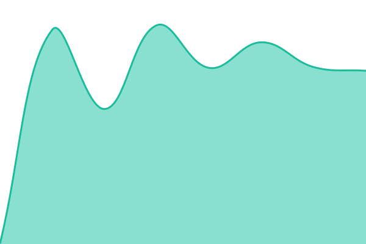

# [📈 Live Status](https://gudasoft.github.io/upptime): <!--live status--> **🟥 Complete outage**

<!--start: status pages-->
<!-- This summary is generated by Upptime (https://github.com/upptime/upptime) -->
<!-- Do not edit this manually, your changes will be overwritten -->
<!-- prettier-ignore -->
| URL | Status | History | Response Time | Uptime |
| --- | ------ | ------- | ------------- | ------ |
|  [Cenite.com](https://www.cenite.com) | 🟥 Down | [cenite-com.yml](https://github.com/gudasoft/upptime/commits/HEAD/history/cenite-com.yml) | 

 7544ms
     
 | 

<a href="https://gudasoft.github.io/upptime/history/cenite-com">73.14%</a>
    

|  [Gudasoft.com](https://www.gudasoft.com/) | 🟥 Down | [gudasoft-com.yml](https://github.com/gudasoft/upptime/commits/HEAD/history/gudasoft-com.yml) | 

 229ms
     
 | 

<a href="https://gudasoft.github.io/upptime/history/gudasoft-com">73.16%</a>
    

|  [Gudasoft Blog](https://blog.gudasoft.com/) | 🟥 Down | [gudasoft-blog.yml](https://github.com/gudasoft/upptime/commits/HEAD/history/gudasoft-blog.yml) | 

 512ms
     
 | 

<a href="https://gudasoft.github.io/upptime/history/gudasoft-blog">0.00%</a>
    

|  [Data Listener](https://data-listener.gudasoft.com/) | 🟥 Down | [data-listener.yml](https://github.com/gudasoft/upptime/commits/HEAD/history/data-listener.yml) | 

 703ms
     
 | 

<a href="https://gudasoft.github.io/upptime/history/data-listener">73.35%</a>
    

|  [Podcast Gudasoft](https://podcast.gudasoft.com/) | 🟥 Down | [podcast-gudasoft.yml](https://github.com/gudasoft/upptime/commits/HEAD/history/podcast-gudasoft.yml) | 

 917ms
     
 | 

<a href="https://gudasoft.github.io/upptime/history/podcast-gudasoft">73.44%</a>
    

|  [Wannapik](https://www.wannapik.com/) | 🟥 Down | [wannapik.yml](https://github.com/gudasoft/upptime/commits/HEAD/history/wannapik.yml) | 

 685ms
     
 | 

<a href="https://gudasoft.github.io/upptime/history/wannapik">100.00%</a>
    

|  [Kvartala](https://www.kvartala.bg/) | 🟥 Down | [kvartala.yml](https://github.com/gudasoft/upptime/commits/HEAD/history/kvartala.yml) | 

 7623ms
     
 | 

<a href="https://gudasoft.github.io/upptime/history/kvartala">73.48%</a>
    

|  [Advokatalexiev](https://advokatalexiev.com/) | 🟥 Down | [advokatalexiev.yml](https://github.com/gudasoft/upptime/commits/HEAD/history/advokatalexiev.yml) | 

 1019ms
     
 | 

<a href="https://gudasoft.github.io/upptime/history/advokatalexiev">73.52%</a>
    

|  [Tkhold](http://www.tkhold.com/) | 🟥 Down | [tkhold.yml](https://github.com/gudasoft/upptime/commits/HEAD/history/tkhold.yml) | 

 4163ms
     
 | 

<a href="https://gudasoft.github.io/upptime/history/tkhold">74.62%</a>
    

|  [Belassitsa](http://belassitsa.com/) | 🟥 Down | [belassitsa.yml](https://github.com/gudasoft/upptime/commits/HEAD/history/belassitsa.yml) | 

 2607ms
     
 | 

<a href="https://gudasoft.github.io/upptime/history/belassitsa">74.71%</a>
    

|  [Pancharevo-bg.com](https://www.pancharevo-bg.com/) | 🟥 Down | [pancharevo-bg-com.yml](https://github.com/gudasoft/upptime/commits/HEAD/history/pancharevo-bg-com.yml) | 

 7249ms
     
 | 

<a href="https://gudasoft.github.io/upptime/history/pancharevo-bg-com">74.74%</a>
    

|  [Host Manager](https://host-manager.gudasoft.com/) | 🟥 Down | [host-manager.yml](https://github.com/gudasoft/upptime/commits/HEAD/history/host-manager.yml) | 

 774ms
     
 | 

<a href="https://gudasoft.github.io/upptime/history/host-manager">74.83%</a>
    

|  [Coaching zone](https://krasimira.dukovska.kvartala.bg) | 🟥 Down | [coaching-zone.yml](https://github.com/gudasoft/upptime/commits/HEAD/history/coaching-zone.yml) | 

 1269ms
     
 | 

<a href="https://gudasoft.github.io/upptime/history/coaching-zone">74.87%</a>
    

|  [Coaching zone - Krasimira Dukovska](https://coaching-zone.kvartala.bg/) | 🟥 Down | [coaching-zone-krasimira-dukovska.yml](https://github.com/gudasoft/upptime/commits/HEAD/history/coaching-zone-krasimira-dukovska.yml) | 

 1275ms
     
 | 

<a href="https://gudasoft.github.io/upptime/history/coaching-zone-krasimira-dukovska">74.90%</a>
    

|  [Vertical Design](https://www.verticalsdesign.bg/) | 🟥 Down | [vertical-design.yml](https://github.com/gudasoft/upptime/commits/HEAD/history/vertical-design.yml) | 

 3996ms
     
 | 

<a href="https://gudasoft.github.io/upptime/history/vertical-design">74.99%</a>
    

|  [Arcadia](http://www.arcadiabg.eu/) | 🟥 Down | [arcadia.yml](https://github.com/gudasoft/upptime/commits/HEAD/history/arcadia.yml) | 

 874ms
     
 | 

<a href="https://gudasoft.github.io/upptime/history/arcadia">75.09%</a>
    

|  [Arcadia Herba](http://arcadia-herba.com) | 🟥 Down | [arcadia-herba.yml](https://github.com/gudasoft/upptime/commits/HEAD/history/arcadia-herba.yml) | 

 6877ms
     
 | 

<a href="https://gudasoft.github.io/upptime/history/arcadia-herba">84.64%</a>
    

|  [Dentist](http://dentist.gudasoft.com/) | 🟥 Down | [dentist.yml](https://github.com/gudasoft/upptime/commits/HEAD/history/dentist.yml) | 

 756ms
     
 | 

<a href="https://gudasoft.github.io/upptime/history/dentist">75.20%</a>
    

|  [DGD](http://dgd.gudasoft.com/) | 🟥 Down | [dgd.yml](https://github.com/gudasoft/upptime/commits/HEAD/history/dgd.yml) | 

 475ms
     
 | 

<a href="https://gudasoft.github.io/upptime/history/dgd">75.30%</a>
    

|  [rezovo](http://rezovo.net/) | 🟥 Down | [rezovo.yml](https://github.com/gudasoft/upptime/commits/HEAD/history/rezovo.yml) | 

 867ms
     
 | 

<a href="https://gudasoft.github.io/upptime/history/rezovo">75.33%</a>
    

|  [negociant](https://negociant.bg/) | 🟥 Down | [negociant.yml](https://github.com/gudasoft/upptime/commits/HEAD/history/negociant.yml) | 

 1300ms
     
 | 

<a href="https://gudasoft.github.io/upptime/history/negociant">64.09%</a>
    

<!--end: status pages-->

[**Visit our status website →**](https://gudasoft.github.io/upptime)

## 📄 Credits

- Powered by: [Upptime](https://github.com/upptime/upptime)
- Code: [MIT](./LICENSE) © [Anand Chowdhary](https://anandchowdhary.com), supported by [Pabio](https://pabio.com)
- Data in the `./history` directory: [Open Database License](https://opendatacommons.org/licenses/odbl/1-0/)
